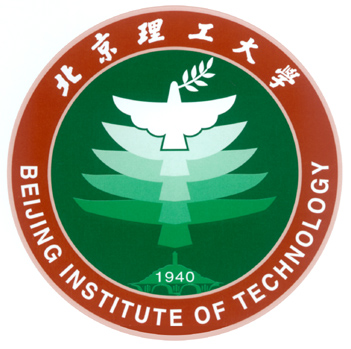
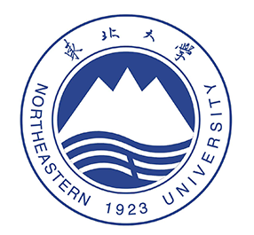

#  🙋 Hello
<table>
  
<tr><td>

### 🤺 About Me

<!--  -->

&emsp;&emsp;嗨，我是正在学习！。热爱编程、编程、编程。

&emsp;&emsp;是git小萌新！初来乍到，请多多指教。ヾ(´∀｀。ヾ)

&emsp;&emsp;学无止境，我相信我会在coding的路上一直走下去！

&emsp;&emsp;<strong>Yesterday is history. Tomorrow is a mystery. But today is a gift. That is why it’s called the present.‌</strong>

  <!-- for beauty 留个空行好看点 -->
  
&nbsp;

</td></tr>

<tr><td>

## 🏢 school Experience

<!--  -->

- [北京理工大学]([https://www.grcbank.com](https://www.bit.edu.cn/)/) &emsp; 📌 2023-09 —— 2026-07

  - 硕士
  - 专业：电子科学与技术
  - 研究方向：图像感知

<!--  -->

- [东北大学（秦皇岛）]([https://www.inspur.com/](https://www.neuq.edu.cn/))   📌 2019-07 —— 2020-02

  - 本科
  - 专业：计算机科学与技术

  <!-- for beauty 留个空行好看点 -->
  
&nbsp;

  
</td></tr>

</table>
